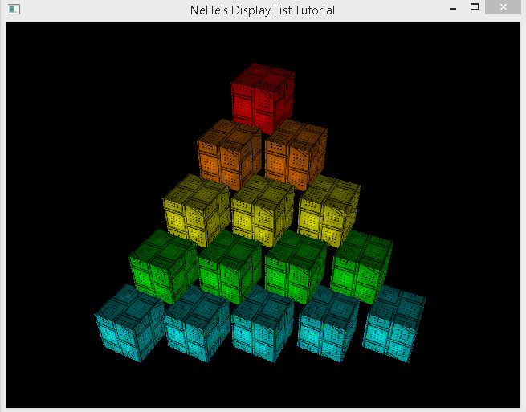
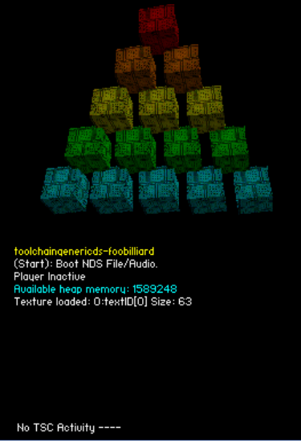

ndsDisplayListUtils: 
OpenGL 1.1 driver for NintendoDS GX 3D hardware using VideoGL and TGDS API.

Changelog:

////////////////////////////////Vertex Array Buffers and Vertex Buffer Objects OpenGL 1.1 ////////////////////////////////
1.0:
		OpenGL 1.1 VBO & VBA implemented successfully into NintendoDS apps, running example:
		https://bitbucket.org/Coto88/toolchaingenericds-unittest/

0.9:
		Implemented:
		-void glGetPointerv( GLenum pname, GLvoid **params )
		
		Stubbed out because outsize of OpenGL 1.1:
		-void glBufferSubData(GLenum target, GLint offset, GLsizei size, void* data)

		standardize GL arrays as defined by the OpenGL1.1 specs: float as v10/v16 for vertices, float as t16 for texCoords, float as u8 for color, float as v10 for normals.
		Means:
		It's now possible to cast arrays as packed floats, it's just the moment the float values are generated, these will require correct GX bitdepth formats:
		floattov16, floattov10, floattot16, etc

0.8:
		Implemented:
		-void glInterleavedArrays( GLenum format, GLsizei stride, const GLvoid *pointer )
		-void glArrayElement( GLint index )
		
		Stubbed out because outsize of OpenGL 1.1:
		-void glDrawElements( GLenum mode, GLsizei count, GLenum type, const GLvoid *indices )

0.7:
		Implemented:
		-void glGenBuffers(GLsizei n, GLuint* ids)
		-void glDeleteBuffers(GLsizei n, const GLuint* ids)
		-void glBindBuffer(GLenum target, GLuint id)
		-void glBufferData(GLenum target, GLsizei size, const void* data, GLenum usage)

		Made OpenGL 1.5 standard:
		-void glVertexPointer(GLint size, GLenum type, GLsizei stride, const GLvoid *ptr)
		-void glIndexPointer( GLenum type, GLsizei stride, const GLvoid *ptr )

		Todo implement:
		-void glInterleavedArrays( GLenum format, GLsizei stride, const GLvoid *pointer )
		-void glDrawElements( GLenum mode, GLsizei count, GLenum type, const GLvoid *indices )
		-void glArrayElement( GLint i )
		-void glGetPointerv( GLenum pname, GLvoid **params )
		-void glBufferSubData(GLenum target, G

0.6:
		-glVertexPointer
		-glNormalPointer
		-glColorPointer
		-glIndexPointer
		-glTexCoordPointer
		Added relativeness to stride:
		“stride:
		The byte offset between consecutive vertices. When stride is zero, the vertices are tightly packed in the array.”
		And that’s because arrays can mixed other args than vertices, like normals, texture coords or colors (like any precompiled DisplayList in GX buffer would have)

0.5: 	- Laydown groundwork for new VBO & VBA API
		- Implement void glDrawArrays( GLenum mode, GLint first, GLsizei count )
		- Now OpenGL DisplayList context is split between internal (VBO & VBA) and usermode (Normal OpenGL 1.0 Display Lists support)
		- cleanup

/////////////////////////////////////////////OpenGL Display List support/////////////////////////////////////////////
[NeHe OpenGL Lesson 12: Display List]

WIN32:

NDS:

0.4: OpenGL Display Lists Implementation finished.

0.3: Standardized format so it's conformant with Open GL Display Lists.

0.2: Ported to NintendoDS.

0.1: First release, WIN32 only.

Coto.